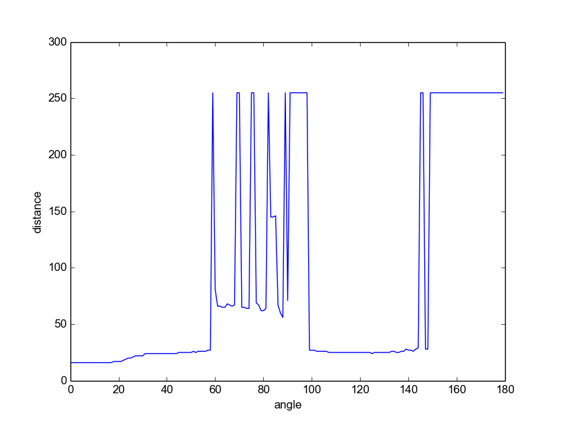

#### When placed facing and perpendicular to a smooth surface such as a wall, what are the minimum and maximum depths that the sensor can reliably measure?

The sensor is 12cm away from the center of the robot.

The minimum depth the sensor can reliably measure is 1cm.

The maximum depth the sensor can reliably measure is 210cm.

Our metric for reliable measurement is simply whether the value is stable and reasonable. For example when the sensor is very very close to the wall it reads 255 which is clearly wrong. Also when the sensor is over 2 meters away from the wall it gets stuck at 255 which indicates the measurement is no longer correct.

##### A test to check how sensor value changes with distance
| Distance (cm) | Sensor Value (0-255) | Difference |
|---------------|----------------------|------------|
| 4             | 6                    | 2          |
| 6             | 8                    | 2          |
| 8             | 11                   | 3          |
| 20            | 23                   | 3          |
| 50            | 51                   | 1          |
| 100           | 101                  | 1          |
| 150           | 151                  | 1          |
| 210           | 211                  | 1          |

####  Move the sonar so that it faces the wall at a non-orthogonal incidence angle. What is the maximum angular deviation from perpendicular to the wall at which it will still give sensible readings?

####  Do your sonar depth measurements have any systematic (non-zero mean) errors? To test this, set up the sensor at a range of hand-measured depths (20cm, 40cm, 60cm, 80cm, 100cm) from a wall and record depth readings. Are they consistently above or below what they should be?

####  What is the the accuracy of the sonar sensor and does it depend on depth? At each of two chosen hand-measured depths (40cm and 100cm), make 10 separate depth measurements (each time picking up and replacing the sensor) and record the values. Do you observe the same level of scatter in each case?
##### 40 cm
| Sensor Value 40cm | Sensor Value 100cm |
|-------------------|--------------------|
| 41                | 102                |
| 42                | 101                |
| 41                | 102                |
| 41                | 102                |
| 42                | 102                |
| 41                | 103                |
| 42                | 101                |
| 41                | 102                |
| 43                | 102                |
| 41                | 103                |

####  In a range of general conditions for robot navigation, what fraction of the time do you think your sonar gives garbage readings very far from ground truth?
